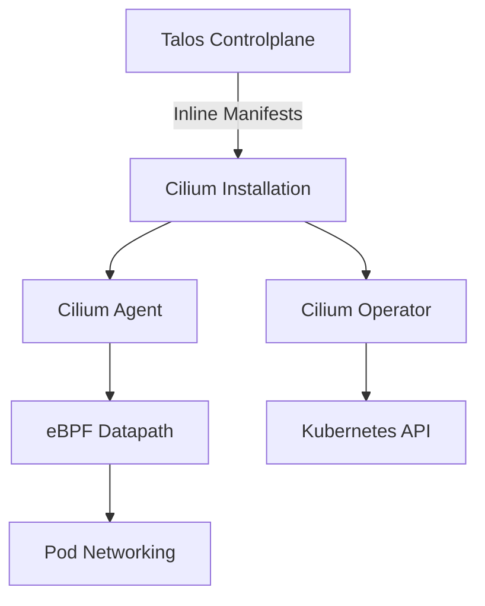

# Terraform / Talos - déploiement vixens-dev (controlplanes)

# Terraform / Talos - Déploiement vixens-dev (Controlplanes avec Cilium CNI)

Emplacement projet:
`~/vixens-new/terraform/environments/dev/`

## Architecture

Ce déploiement configure des nœuds Talos en tant que controlplanes avec **Cilium** comme CNI (Container Network Interface), installé automatiquement via la méthode des inline manifests.

## Fichiers du projet

### Configuration principale
- `main.tf` - Configuration Terraform des ressources Talos
- `variables.tf` - Définition des variables Terraform
- `terraform.tfvars` - Valeurs des variables (secrets)

### Configuration Talos
- `controlplane.yaml` - Configuration de base Talos (référencée dans `terraform.tfvars`)
- `cilium.yaml` - Manifeste Cilium généré via Helm (non versionné, à générer)
- `cilium-patch.yaml.tftpl` - Template Terraform pour l'intégration Cilium

### Patches machines
- `vixens-obsy.yaml` - Patch pour le nœud obsy
- `vixens-onyx.yaml` - Patch pour le nœud onyx  
- `vixens-dev-opale.yaml` - Patch pour le nœud opale

## Prérequis

### Logiciels requis
- Terraform ≥ 1.0 (compatible avec les exigences du provider)
- Helm ≥ 3.0 (pour générer le manifeste Cilium)

### Infrastructure
- Node(s) Talos en mode maintenance, accessibles aux IPs indiquées:
  - obsy → 192.168.208.162
  - onyx → 192.168.208.164
  - opale → 192.168.208.163

### Fichiers requis
- `controlplane.yaml` généré par `talosctl gen config`
- Les patch files (`vixens-*.yaml`) à l'emplacement indiqué
- Talos client certs (déjà configurés dans `terraform.tfvars`)
- **⚠️ `cilium.yaml` doit être généré avant le déploiement**

## Installation de Cilium

### Générer le manifeste Cilium
```bash
# Ajouter le repo Cilium
helm repo add cilium https://helm.cilium.io/
helm repo update

# Générer le manifeste
helm template cilium cilium/cilium \
  --version 1.18.2 \
  --namespace kube-system \
  --set ipam.mode=kubernetes \
  --set kubeProxyReplacement=true \
  --set securityContext.capabilities.ciliumAgent="{CHOWN,KILL,NET_ADMIN,NET_RAW,IPC_LOCK,SYS_ADMIN,SYS_RESOURCE,DAC_OVERRIDE,FOWNER,SETGID,SETUID}" \
  --set securityContext.capabilities.cleanCiliumState="{NET_ADMIN,SYS_ADMIN,SYS_RESOURCE}" \
  --set cgroup.autoMount.enabled=false \
  --set cgroup.hostRoot=/sys/fs/cgroup \
  --set k8sServiceHost=localhost \
  --set k8sServicePort=7445 > cilium.yaml
```

### Configuration réseau
- **CNI**: Cilium (installation automatique via inline manifests)
- **Kube-proxy**: Désactivé (remplacé par Cilium)
- **IPAM**: Mode Kubernetes
- **Cgroup**: V2 (fourni par Talos)

## Déploiement

### Préparation
```bash
cd ~/vixens-new/terraform/environments/dev

# Sécuriser le fichier de variables
chmod 600 terraform.tfvars

# Vérifier que cilium.yaml est présent
ls -la cilium.yaml
```

### Déploiement Terraform
```bash
# Initialisation
terraform init

# Validation
terraform validate

# Planification (vérifier les changements)
terraform plan -var-file=terraform.tfvars

# Application (si plan OK)
terraform apply -var-file=terraform.tfvars
```

## Post-déploiement

### Vérifier l'installation de Cilium
```bash
# Se connecter au cluster
talosctl kubeconfig

# Vérifier les pods Cilium
kubectl -n kube-system get pods -l app.kubernetes.io/name=cilium

# Vérifier le status Cilium
cilium status
```

### Composants installés
- **Cilium Agent**: Sur chaque nœud
- **Cilium Operator**: Gestionnaire du cluster
- **Hubble**: Observabilité du réseau (si activé)
- **CNI Plugin**: Configuration automatique

## Destruction du cluster

### Méthode RAZ (Destructiion totale)
Le cluster est détruit de manière brutale sans graceful shutdown :
- Pas de drain Kubernetes
- Reset direct avec `--graceful=false`
- Destruction parallèle des nœuds

### Limitations Terraform
Les provisioners de destruction utilisent `self.triggers` pour accéder aux valeurs des nœuds (car `each.value` est interdit en phase destroy).

## Architecture réseau



## Dépannage

### Erreurs courantes

**Erreur: "could not find expected ':'"**
- Cause: Problème d'indentation dans cilium.yaml
- Solution: Vérifier que cilium.yaml est bien généré et valide

**Cilium pods en CrashLoopBackOff**
- Vérifier les logs: `kubectl -n kube-system logs <cilium-pod-name>`
- Vérifier la compatibilité des versions Talos/Cilium

**Problèmes de connectivité réseau**
- Vérifier le status Cilium: `cilium status`
- Vérifier les politiques réseau: `kubectl get ciliumnetworkpolicies`

### Logs et debugging
```bash
# Logs Cilium
kubectl -n kube-system logs -l app.kubernetes.io/name=cilium

# Status du node
talosctl -n <node-ip> get members

# Configuration réseau
talosctl -n <node-ip> get addresses
```

## Sécurité

- Le fichier `terraform.tfvars` contient des secrets et doit être protégé (`chmod 600`)
- Le manifeste `cilium.yaml` contient des secrets Kubernetes
- Cilium remplace kube-proxy pour une meilleure sécurité via eBPF
- Les capacités Linux sont strictement définies pour Cilium

## Mise à jour

### Mise à jour de Cilium
1. Générer un nouveau `cilium.yaml` avec la version souhaitée
2. Relancer `terraform apply`
3. Cilium se mettra à jour automatiquement

### Mise à jour de Talos
Suivre la procédure standard Talos, Cilium restera fonctionnel pendant la mise à jour.
